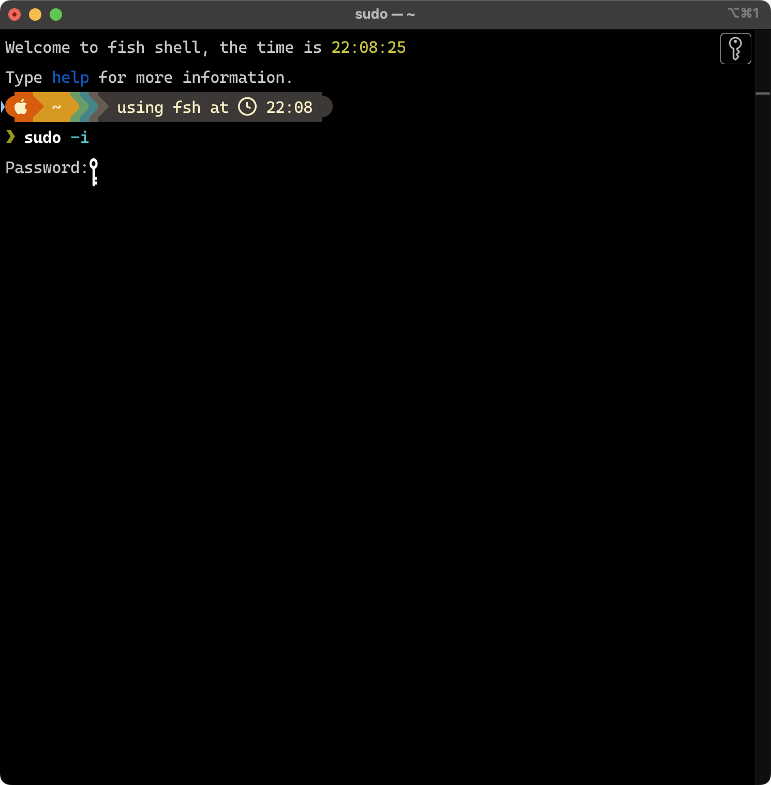

> 本文档 [`Frontmatter`](https://github.com/BTMuli/MuCli#Frontmatter) 由 [MuCli](https://github.com/BTMuli/Mucli) 自动生成于 `2024-10-07 21:16:38`
>
> 更新于 `2024-10-07 21:48:11`

[中文版本](./README.md)

# Special Tips for macOS Users

Due to Teyvat Guide not being notarized by Apple, some additional steps are required to ensure that Teyvat Guide can run smoothly on the macOS platform.

> Teyvat Guide is an open-source software based on the MIT license, and all source code is hosted on GitHub. If you have concerns about the security of the software, you can review the source code yourself or download and compile it.

## Apple's Related Links on "Allowing Apps from Anywhere" and Gatekeeper

- [Safely open apps on your Mac](https://support.apple.com/102445)
- [Gatekeeper and runtime protections in macOS](https://support.apple.com/guide/security/sec5599b66df/)
- [Preventing against malware in macOS](https://support.apple.com/guide/security/sec469d47bd8/)

## Error Prompt

Please ensure that Teyvat Guide has been installed, meaning it has been copied to the `/Applications` directory.

> Note: The "enter password" process described below will not display on the console; only a key icon will appear. Please enter the password based on your intuition and press Enter to confirm.
> 

## Method 1: One-Click Script

### Step 1: Download the Script

Download the `one-click.sh` file in this folder, open the terminal, enter `bash /path/to/the/script`, and press Enter. Follow the on-screen instructions.

> `/path/to/the/script` represents the location where the script is downloaded.

### Step 2: Launch Teyvat Guide

Locate the installation location of Teyvat Guide in Finder, **right-click (or hold down the control⌃ key and click)** to choose "Open."

## Method 2: Manual Operations

During the process, you may be asked to enter a password, where "password" refers to the administrator account password:

1. If you have only one account on your computer, then the "password" is the one you use to log in and unlock your computer;
2. If you have multiple accounts on your computer, you should know what "password" means here. :-D

### Step 1: Enable "Allow Apps from Anywhere"

Open the terminal, enter `sudo spctl --master-disable` to enable "Allow Apps from Anywhere", and make the selection "Allow applications from **anywhere**" in the "Privacy & Security" section in System Preferences， **you may need to scroll down**.

### Step 2: Clear Gatekeeper Attributes

Enter `sudo xattr -c /Applications/TeyvatGuide.app` in the terminal to clear the Gatekeeper attributes of Teyvat Guide.

### Step 3: Launch Teyvat Guide

Locate the installation location of Teyvat Guide in Finder, **right-click (or hold down the control⌃ key and click)** to choose "Open."

