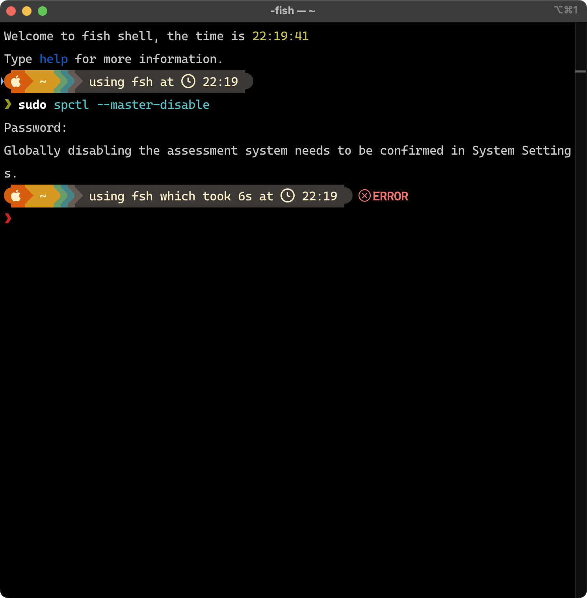
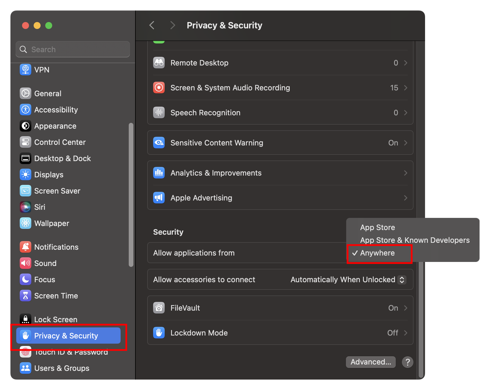

[English Version](README-EN.md)

# 针对 macOS 用户的特殊提示

由于 Teyvat Guide 没有经过苹果官方公证，故需要进行一些额外的操作来确保 Teyvat Guide 能在 macOS 平台正常运行。

> Teyvat Guide 是一个**基于 MIT 协议**的开源软件，所有源代码都托管在 GitHub 上，如果您对软件安全性抱有疑虑，可以自行审查源代码或者下载编译打包。

## Apple 关于任何来源及门禁(`Gatekeeper`)属性的相关链接

- [在 Mac 上安全地打开 App](https://support.apple.com/102445)
- [macOS 中的门禁和运行时保护](https://support.apple.com/guide/security/sec5599b66df/)
- [在 macOS 中防范恶意软件](https://support.apple.com/guide/security/sec469d47bd8/)

## 报错界面

下面的所有操作请**确保 Teyvat Guide 已经安装**，即 Teyvat Guide 已经被复制到 `/Applications` 目录下。

> 注：下面所述的“输入密码”过程不会在控制台上显示，仅会显示一个钥匙图标，请~~凭感觉~~输入后按回车键确认。
> 

## Method 1 一键脚本

### Step 1 下载脚本

下载此文件夹中的 `one-click.sh`，打开终端，输入`bash /path/to/the/script`后回车，按照屏幕提示操作。

> `/path/to/the/script` 表示下载的脚本的位置。

### Step 2 启动 Teyvat Guide

在访达中找到 Teyvat Guide 的安装位置，**右键（或按住键盘上的control⌃并点击）选择打开**。

## Method 2 手动操作

过程中可能会要求输入密码，此处的“密码”指的是管理员账户的密码：

1. 如果你的电脑只有一个账户，那么“密码”就是你登录解锁电脑的密码；
2. 如果你的电脑不止一个账号，那么你应该知道此处“密码”的含义。:-D

### Step 1 开启“任何来源”

打开终端，输入`sudo spctl --master-disable`开启“任何来源”，并在设置中的“安全与隐私”部分进行选择，**你可能需要向下滑动**。

  

  

### Step 2 清除门禁属性

在终端输入`sudo xattr -c /Applications/TeyvatGuide.app`清除 Teyvat Guide 的 `Gatekeeper` 属性。

### Step 3 启动 Teyvat Guide

在访达中找到 Teyvat Guide 的安装位置，**右键（或按住键盘上的control⌃并点击）选择打开**。

